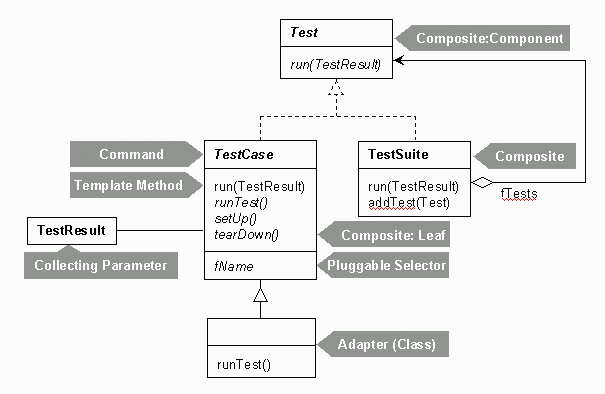
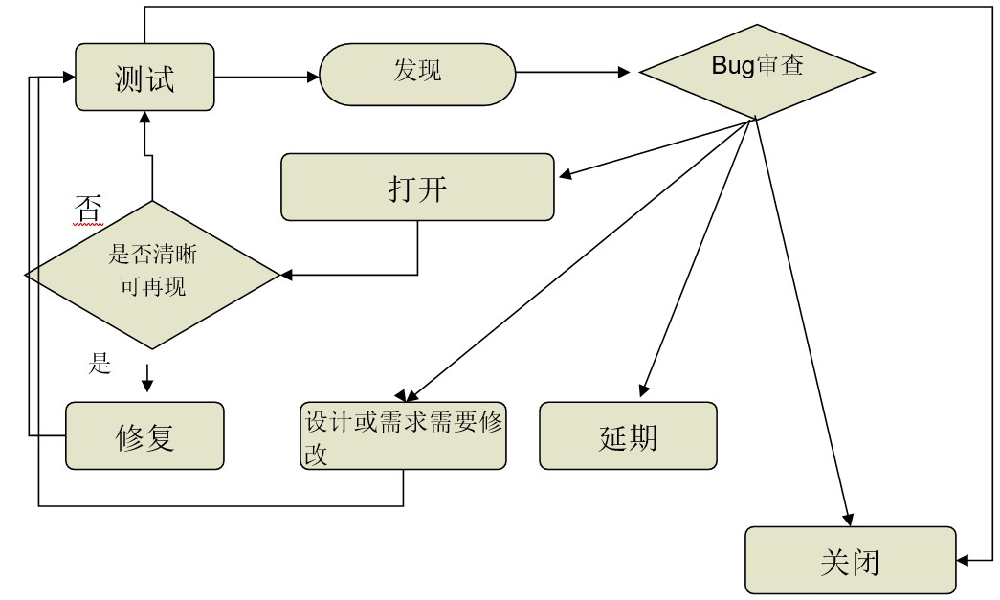

# 软件测试与维护：试卷结构
Based on Final-Exam 2015-2019

Author: @SJoshua

## 名词解释 (5pts * 5 = 25pts)
### 与测试相关的过程模型
* V Model
  > 需求分析 -> 规格说明书 -> 概要设计 -> 功能设计 -> 编码 -> 单元测试 -> 集成测试 -> 系统测试 -> 验收测试

* W Model
  > 需求分析 -> 概要设计 -> 详细设计 -> 编码 -> 集成 -> 系统确认 -> 交付

  > 需求测试 -> 概要设计测试 -> 详细设计测试 -> 单元测试 -> 集成测试 -> 系统测试 -> 验收测试

* H Model
  > (测试流程) 测试准备 -> 测试就绪点 -> 测试执行 

  > (其他流程) ．．．．．．．↑．．．．．．．
  
  测试准备活动：测试计划、测试设计、测试开发

  测试执行活动：测试运行和测试评估
  
### 软件测试
* 软件测试
  > 尽可能早地找出软件缺陷，并确保其得以修复的活动。
* 单元测试
  > 单元测试是对软件基本组成单元进行的测试。
* 集成测试
  > 将单元组装起来再进行测试，以检查这些单元之间的接口是否存在问题，如：数据丢失、模块间相互影响、组合后不能实现主功能等。
* 系统测试
  > 在集成测试结束之后，依据系统的需求规格说明书和产品功能说明书对系统的整体功能进行的全面测试，称为功能测试。除此之外还有非功能特性的测试。
* 回归测试 
  > 对修正缺陷后的软件进行再次的测试，不仅测试被修复的软件缺陷是否已经解决，还要测试软件旧有的功能与非功能是否满足要求。
* 验收测试
  > 在软件产品完成功能测试与系统测试后、产品发布前进行的软件测试活动。技术测试的最后一个阶段。
* 冒烟测试
  > 关于冒烟测试，冒烟测试就是在每日Build建立后，对系统的基本功能进行简单的测试。
* 压力测试
  > 压力测试是在一种需要反常数量、频率或资源的方式下，执行可重复的负载测试或强度测试，以检查程序对异常情况的抵抗能力，找出性能瓶颈。
* 稳定性压力测试(可靠性测试/疲劳测试)
  > 连续运行被测系统，检查系统运行时的稳定程度。
* 破坏性压力测试
  > 持续不断的给被测系统增加压力，直到将被测系统压垮为止（让问题与薄弱环节快速暴露出来，找出瓶颈）。用来测试系统所能承受的最大压力。
* 容量测试
  > 容量测试目的是通过测试预先分析出反映软件系统应用特征的某项指标的极限值（如最大并发用户数、数据库记录数等），系统在其极限值状态下还能保持主要功能正常运行。
* 性能测试
  > 通过测试确定系统运行期间的性能表现与性能数据，得到如：CPU使用的效率、运行速度、响应时间、占有系统资源等方面的系统数据。
* 安全测试
  > 安全性测试是检查系统对非法侵入的防范能力。安全测试期间，测试人员假扮非法入侵者，采用各种办法试图突破防线。
* 容错测试
  > 容错性测试是检查软件在异常条件下自身是否具有防护性的措施或者某种灾难性恢复的手段。
* Testcase
  > 满足特定目的的测试数据、测试代码、测试规程的集合。
* Alpha Testing
  > α测试是指软件开发公司组织内部人员模拟各类用户对即将面市软件产品（称为α版本）进行测试，试图发现错误并修正。
* Beta Testing
  > β测试是指软件开发公司组织各方面的典型用户在日常工作中实际使用β版本，并要求用户报告异常情况、提出批评意见。然后软件开发公司再对β版本进行改错和完善。

### 软件维护
* Software Maintenance
  > 软件维护指系统交付使用以后，为了改善错误或是为了满足新的需要而修改软件的过程。分为改正性、适应性、完善性、预防性四类。

### 集成测试
* Driver
  > 驱动模块，模拟被测模块的上级模块，驱动模块在集成测试中接受测试数据，把相关的数据传送给被测模块，启动被测模块，并打印出相应的结果。
* Stub
  > 桩模块，模拟被测模块工作过程中所调用的模块，一般仅进行较少的数据处理，用于检验被测模块与其下级模块的接口。

### 黑/白盒测试
* Black-box Testing
  > 不涉及程序结构、用软件规格说明生成测试用例、包括功能测试和系统测试、某些代码段得不到测试。
* Dynamic Black-box Testing
  > 不深入代码细节测试软件的方法。
* White-box Testing
  > 考察程序逻辑结构、用程序结构信息生成测试用例、包括单元测试和集成测试、对所有逻辑路径进行测试。
* Static White-box Testing
  > 在不执行软件的条件下有条理地仔细审查软件设计、体系结构和代码，从而找出软件缺陷的过程。

  > 正式审查(Formal Review)即为进行静态白盒测试的过程。
* Walkthroughs
  > 走查：采用讲解、讨论和模拟运行的方式进行的查找错误的活动。

* Peer Reviews
  > 由程序员和（或）测试员组成的非正式小组充当审查者来查找错误的活动。
* Condition Coverage
  > 条件覆盖

### 版本测试
* Version Control
  > 版本控制就是管理在整个软件生存周期中建立起来的某一配置项的不同版本。在软件工程过程中所涉及的软件对象都要加以标识。在对象成为基线以前可能要做多次变更，在成为基线之后也可能需要频繁地变更。这样对于每一配置对象可以建立一个演变图，以方便记叙这个对象的变更历史

### 测试驱动开发
* Test-Driven Development
  > TDD测试驱动开发的基本思想就是在开发功能代码之前，先编写测试代码。也就是说在明确要开发某个功能后，首先思考如何对这个功能进行测试，并完成测试代码的编写，然后编写相关的代码满足这些测试用例。然后循环进行添加其他功能，直到完全部功能的开发。

## 简答题 (3 problems, 20pt)
### *Unit
* 绘制JUnit结构图
  > 

### Bug定义
* Bug与Specification的关系
  > 1. The software does not do something that the specification says it should do. (没做该做的)
  > 2. The software does something that the specification says it should not do. (做了不该做的)
  > 3. The software does something that the specification does not mention. (做了没说的)
  > 4. The software does not do something that the product specification does not mention but should. (没做没说但该做的)
  > 5. The software is difficult to understand, hard to use, slow … (其它)

* 发现Bug的时间与修复Bug所需代价的关系
  > 指数级

### Bug管理
* 绘制Bug管理过程图
  > 

### 软件维护及配置
* 软件维护的定义及其分类
  > 软件维护是指软件系统交付使用以后，为了改正错误或满足新的需要而修改软件的过程，包括改正性维护、适应性维护、完善性维护、预防性维护。
* 什么是软件的可维护性
  > 软件可维护性是指纠正软件系统出现的错误和缺陷，以及为满足新的要求进行修改、扩充或压缩的容易程度。
  > 
  > 目前广泛使用的是用如下的七个特性来衡量程序的可维护性：可理解性、可使用性、可测试性、可移植性、可修改性、效率、可靠性
* 软件配置管理的过程
  > 配置管理计划、配置库管理、变更管理、版本管理、配置审计

### 软件测试
* 软件测试与SQA之间的关系
  > 1. SQA(Software Quality Assurance)是通过对软件产品和活动有计划地进行评审和审计来验证软件是否合乎标准的系统工程活动。
  > 2. SQA是管理工作，其审查对象是流程，强调以预防为主；测试是技术实施工作，其测试对象是产品，主要是以事后检查（文档、程序）为主。
  > 3. SQA指导测试、监控测试；测试为SQA提供依据；测试是SQA的一个环节、一个手段。
* 什么是软件测试
  > 尽可能早地找出软件缺陷，并确保其得以修复的活动。
* 测试与调试的区别
  > 1. 测试发展的初期，测试就是调试，而现在测试是一个系统化工程化的概念，调试的范畴更小一些。
  > 2. 调试不属于测试，是编码阶段的工作，由程序员完成；调试与测试的对象及采用的方法有很大程度上的相似，调试还用到断点控制等排错方法，但其目的却完全不同。
  > 3. 测试由测试员或程序员完成。
  > 4. 测试是为了找出软件中存在的缺陷；而调试是为了解决存在的缺陷。
  > 5. 成功的测试发现了错误的症状，从而引起调试的进行。
* 测试小组
  > 测试经理、环境管理人员、测试组长、测试设计人员、初级测试工程师、发布工程师、配置管理员
* 测试环境
  > 软件、硬件 + 网络环境、数据准备、测试工具

### 单元测试
* 简述单元测试的任务
  > 1. 模块接口测试
  > 2. 模块局部数据结构测试
  > 3. 模块边界条件测试
  > 4. 模块独立执行通路测试
  > 5. 模块的各条错路处理通路测试

### 集成测试
* 绘制至上而下/至下而上集成测试的模型图并描述其区别
  > 自顶向下：从最顶级模块开始，使用桩模块替代下层模块，完成测试后使用下层模块替换桩模块。

  > 自底向上：从最底部模块开始，使用驱动模块替代上层模块，完成测试后使用上层模块替换驱动模块。

  > |                   |自底向上|自顶向下|
  > | ----------------- |-------|-------|
  > | 集成               | 早    | 早    |
  > | 基本程序能工作时间  | 晚    | 早    |
  > | 需要驱动程序       | 是     | 否    |
  > | 需要桩程序         | 否     | 是    | 
  > | 计划与控制         | 容易   | 难    |
* 两种模式
  > 渐增式测试模式：把下一个要测试的模块同已经测试好的模块结合起来进行测试，测试完以后再把下一个应该测试的模块结合进来测试。
  
  > 非渐增式测试模式：先分别测试每个模块，再把所有模块按设计要求放在一起结合成所要的程序，如Big Bang模式。

### 压力测试
* 简述压力测试的分类及两者间区别
  > 压力测试分为稳定性压力测试和破坏性压力测试两种。前者是持续运行系统，以检测系统的稳定程序。后者是持续不断的给被测系统增加压力，直到将被测系统压垮为止，用来测试系统所能承受的最大压力。
* 如何使用Loadrunner测试工具来进行压力测试 
  > 1. Virtual User Generator创建脚本；选择协议；录制脚本；编辑脚本；检查修改脚本。
  > 2. 中央处理器调度虚拟用户：创建Scenario，选择脚本；设置机器虚拟用户数；设置Schedule；如果模拟多机测试，设置IP Spoofer。
  > 3. 运行脚本：分析Scenario。
  > 4. 分析测试结果。

## 分析题 (黑盒 + 白盒, 35pts; 软件测试/维护，20pts)
### 程序流程图和控制流图
* 绘制程序流程图和控制流图
* 计算程序流图中的条件数

### 功能测试
* 描述如何完成功能测试
  > 依据系统的需求规格说明书和产品功能说明书对系统的整体功能进行全面测试。
* 给定测试策略，如何准备测试
  > 描述目前在进行哪一阶段的测试（如单元测试、集成测试、系统测试）以及每个阶段内进行的测试种类（如功能测试、性能测试、压力测试等）和方法，以确定合理的测试方案使得测试更有效。
  > 组建测试队伍、时间安排、压力测试、功能测试

### 验收测试
* 验收测试的定义和条件
  > 需要先完成功能测试和系统测试，来模拟最终用户的使用场景。如果开发尚未完成，是无法进行验收测试的。
  > 
  > 设计测试用例，使其覆盖尽可能多的有效等价类，直至有效等价类均被覆盖。
  >
  > 设计测试用例，使其只覆盖一个无效等价类，直至所有无效等价类均被覆盖。
### 测试用例设计
#### 黑盒测试
* 等价类划分法
  > 等价类划分法是把程序的输入域划分成若干部分，然后从每个部分中选取少数代表性数据当作测试数据。
* 边界值分析法
  > 确定输入和输出的边界情况，对每个边界建立三个测试样例。
* 错误推测法
  > 通过经验和直觉进行推测。
* 判定表驱动分析法
  * 建立判定表
    > 包含条件桩、动作桩、条件项、动作项和规则。
    > 
    > 设计测试用例，覆盖所有原始判定表规则。
  * 简化判定表
* 因果图法
* 场景法
#### 白盒测试
* 控制流测试
  * 逻辑分支覆盖法
    * 语句覆盖
      > 使得每条语句至少执行一次。
    * 判定覆盖
      > 使得每个条件分支至少经历一次。
    * 条件覆盖
      > 使得每个条件的可能取值至少执行一次。
    * 判定-条件覆盖
      > 设计足够的测试用例，使得每个条件的所有可能至少出现一次，并使每个判定的判定结果也至少出现一次。
    * 条件组合覆盖
      > 设计足够的测试样例，使得每个判断的所有可能的条件取值组合至少执行一次。但路径还是可能会存在遗漏。
  * 路径法
    * 路径覆盖
      > 设计足够的测试样例，覆盖程序中所有可能路径。
    * 基本路径测试法
      > 流图表示控制逻辑
* 数据流测试（不考）
  
### 软件开发
* 软件开发的几个阶段
  > 瀑布模型：需求分析 -> 设计 -> 编程 -> 测试 -> 维护
* 软件需求变更的流程
  > 1. 需求变更
  > 2. 开发者分类和确认
  > 3. 需求分析
  > 4. 设计
  > 5. 编码
  > 6. 系统测试
  > 7. 验收测试
  > 8. 交付
